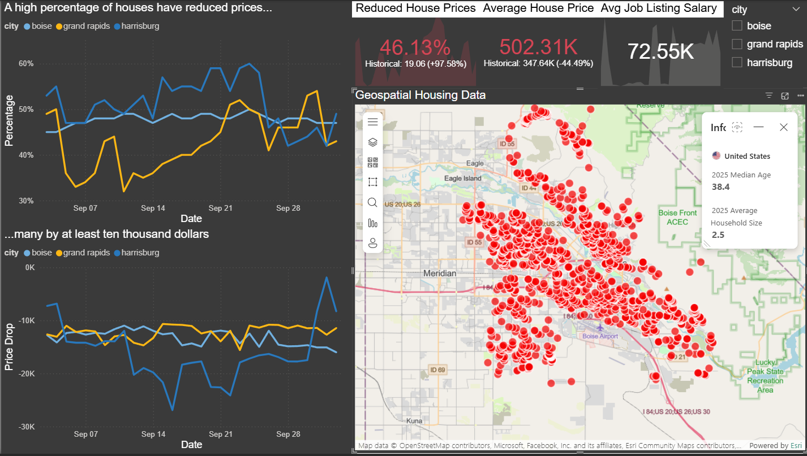
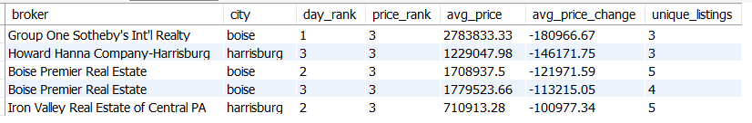
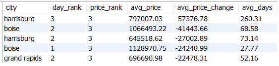

# Full Stack Data Pipeline 
## Analyzing US Housing & Job Data in High Growth Mid-Size Cities

### Executive Summary 
In a real estate market of high interest rates and rising house prices homebuyers have a difficult time finding an affordable house that meets their needs. According to LinkedIn's 2025 "[Cities on the Rise](https://www.linkedin.com/pulse/linkedin-cities-rise-2025-25-fastest-growing-us-metros-jobs-jqiqc/)" report they identified Grand Rapids MI, Boise ID, and Harrisburg PA as the three fastest growing cities for hirings and job postings. Using Python, MySQL, and Power BI, an ETL pipeline was created to scrape data from Zillow, ZipRecruiter, Redfin and ultimately being stored in a database. A dashboard with daily housing market data was created and two strategies were discovered that can save homebuyers an average of $15,112 and $43,604 respectively: 

1. Save $15,112 by purchasing a home that's been listed for 88 days.  
2. Save an average of $43,604 by purchasing from an identified broker. 

### Business Problem 
Relocating to a new city can be overwhelming, especially if it's a high growth city where competition for homes is fierce. Almost half of homes(46%) in the top three cities have reduced their sale price from the original list price. How can we determine the best time for homebuyers to purchase a home to maximize savings? Which brokers have the highest average price drops? 

Figure 1. Power BI dashboard of real estate data.

### Methodology 
1. Automated data pipeline in Python that extracts, cleans, and transforms the data from Zillow, ZipRecruiter, and Redfin then loads it into a MySQL database.

2. An SQL script that transforms and aggregates the database to create views for downstream analysis. 

3. A Power BI dashboard displaying the daily and historical real estate market KPIs and geospatial data of each house.  

### Skills 
SQL: Window functions, CTEs, joins, case statements, aggregate functions, views, database modeling, primary & foreign keys. 

Python: ETL pipeline, data quality checks, Pandas, NumPy, Requests, software design, modules, classes, functions, asynchronous programming, json, logging.  

Power BI: Data visualization, calculated columns, geospatial data.

### Homebuyer Recommendations 
Homebuyers should inform themselves on the historical and latest trends of their future real estate market before making a buying decision. Viewing the dashboard KPIs a homebuyer will see that 46%(compared to a 19% historical average) of houses across all three cities have reduced their prices, signaling the market is overvalued. House prices and their duration on the market were segmented into three categories to conform with the price and time range of a home buyer. Analyzing the data I recommend the following: 

1. Purchase a home that has been on the market for 88 days to save $15,112 off the original price.

2. Identify your city and price range then pick the broker with the highest average price drop from the view below(average savings of $43,604). 

3. Check the dashboard on a daily basis carefully watching the price reductions percentage. Reductions nearing 19% means the housing market is stabilizing.    

Figure 2. SQL view of top 5 brokers.

Following the above recommendations will give a homebuyer the best chance of saving money on their new home. Even in a competitive market deals are available by waiting for a house to be on the market for 3 months and buying from specific brokers. 

 

Figure 3. SQL view of segmented city data.

### Future Development 
1. Upgrade the ETL automation from Task Scheduler to Airflow. 
2. Implement PySpark for data transformations.
3. Identify the portion of price increase attributable to supply-side constraints.
4. Provide access to the data via a REST API. 
5. Add Realtor as a data source. 